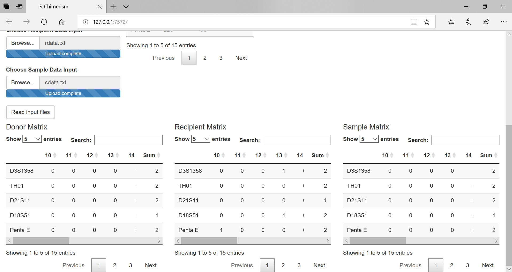

# Rchimerism

Interactive R Package for Automation of Chimerism Test Data Analysis

Rchimerism was designed to automatically select informative loci and calculate chimerism to monitor the cellular dynamics involving engraftment of donor hematopoietic stem cells (HSCs) or relapse of recipient malignant cells in HSC transplant (HSCT) patients. 

Rchimerism starts by reading data from files generated by ABI GeneMapper and a user defined markers file. Through the shiny interface, the donor, recipient, and sample allele matrix can be quickly compared through interactive data tables. Overall donor integration percentages are displayed. Additionally, chimerism can be calculated from double donor cord blood transplantation. The data is available for download to help verify the integrity of the data.

# Pre-requisites:

### R version: 
  * Download R (>3.4.0) version from CRAN:
    * Windows: https://cran.r-project.org/bin/windows/base/
    * Mac OS X: https://cran.r-project.org/bin/macosx/
    * Linux: https://cran.r-project.org/bin/linux/

### Libraries:
  * devtools

To install devtools, use the following command:
```
install.packages("devtools") 
```        
*Note*: Rchimerism also uses shiny and DT packages. However, those packages will be installed if using `install_github` from below.

# Installing Rchimerism:

To install the Rchimerism package all the prerequisites above need to be installed.

Using the R Console, type:
```  
devtools::install_github("BioHPC/Rchimerism") 
```  

In order to use Rchimerism, it must be loaded into the library
```  
library(Rchimerism)
```  

# Pre-processing:

In order to use Rchimerism the data needs to be in a specific format. The locus marker input file must be in '.csv' format. The loci must be listed in the first row of the file. The donor, recipient, and sample data should be generated by the ABI GeneMapper and retain the same format.The DYS391 locus on the Y chromosome is thrown out automatically. Any other uninformative loci on the X/Y chromosome should not have an integer allele in the data files.

Example single donor and double donor can be found in ./example

# Usage with Rchimerism()

* Launch Rchimerism
```  
Rchimerism()
```
# Using Rchimerism Normal Mode

* Load input data
  * Upload csv formatted marker file
  * Upload pre-implantation donor file(s)
  * Upload recipient file
  * Upload post-implantation sample data file
  * Click "Read input files"
  


###Select "Double Donor" option to upload a second donor file


###The 'Final Results' table displays the profile characterization of each allele, along with the overall chimerism percentages.


###Final Results for Double Donor input


###The input data matrices are available for reference at the bottom of the page.



###Double Donor input data matrices


###The results and data matrices can be downloaded as a '.txt' file by selecting 'Download Check File'. Additionally, the results table can be downloaded as a '.xls' file. These files are useful for investigating data errors.


###Rchimerism grays out loci not used in calculations. This can be useful for identifying outlier loci.


#Using Rchimerism Directory Mode

The Directory mode is intended for "power users," or technicians/clinicians tackling a large amount of data.
Directory mode assumes a strict file structure (which would need to be set up) in order to speed up data entry.
An example directory is included in the "Directory_example" folder. The initial use after starting the program will take the longest (file menu starts at the hard drive level, longer to navigate), but subsequent inputs will be quick due to the program remembering the previously selected files.

* Upload csv formatted marker file
* Specify Single Donor or Double Donor input
* Select the folder containing the "sdata.txt" file (cd3,cd33, etc.)
    * The folder (named for the sample date) two directories up should contain the donor and recipient text files (08_19_2019, etc.)
* Press "Read input files" button


The Directory structure is as follows:

* PatientName/Date/CD3/sdata.txt (for post-transplantation data)
* PatientName/ddata.txt (for pre-transplantation donor data, single donor)
* PatientName/rdata.txt (for pre-transplantation recipient data)
* PatientName/d1data.txt (for pre-transplantation donor 1 data, double donor)
* PatientName/d2data.txt (for pre-transplantation donor 2 data, double donor)
	
Example:

    patientID
    |___>ddata.txt
    |___>rdata.txt
    |___>Date
         |___>cd3
         |    |___>sdata.txt
         |___>cd33
              |___>sdata.txt
              
**Rchimerism depends on selection of the folder with "sdata.txt", and assumes that the donor and recipient files are located 2 directories above. This allows for flexibility with folder (not file) names along with additional sample types (cd3, cd33, ...)**
		
Data files (output files from the ABI machine) should always be named as follows (strict):

* ddata.txt -> pre-transplantation single donor data
* rdata.txt -> pre-transplantation recipient data
* d1data.txt -> pre-transplantation donor 1 of double donor
* d2data.txt -> pre-transplantation donor 2 of double donor
* sdata.txt -> post-transplantation chimera data

###Rchimerism chimerism analysis with Directory Mode with single donor input


