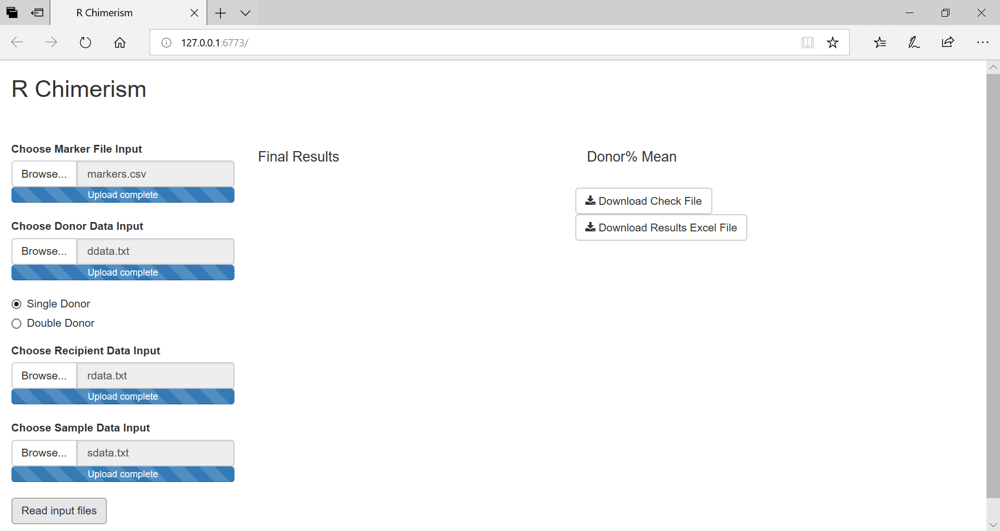
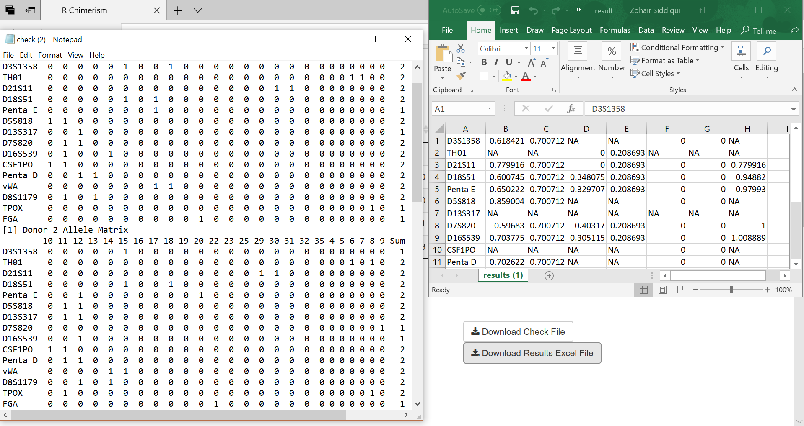
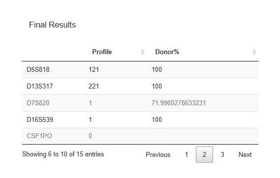

# Rchimerism

Interactive R Package for Automation of Chimerism Test Data Analysis

Rchimerism was designed to automatically select informative loci and calculate chimerism to monitor the cellular dynamics involving engraftment of donor hematopoietic stem cells (HSCs) or relapse of recipient malignant cells in HSC transplant (HSCT) patients. 

Rchimerism starts by reading data from files generated by ABI GeneMapper and a user defined markers file. Through the shiny interface, the donor, recipient, and sample allele matrix can be quickly compared through interactive data tables. Overall donor integration percentages are displayed. Additionally, chimerism can be calculated from double donor cord blood transplantation. The data is available for download to help verify the integrity of the data.

# Pre-requisites:

* R version: 
  * Download R (>3.4.0) version from CRAN:
    * Windows: https://cran.r-project.org/bin/windows/base/
    * Mac OS X: https://cran.r-project.org/bin/macosx/
    * Linux: https://cran.r-project.org/bin/linux/

- shiny package:

    * install by using the following R command:

        > install.packages("shiny")  

- DT package

    * install by using the following R command:

        > install.packages("DT")  

# Installing Rchimerism Package:

To install the Rchimerism package all the prerequisites above need to be installed.
After confirming those packages are installed start RStudio. From there follow the instructions below:

* Tools dropdown -> Install Packages…
* Change the Install from dropdown to Package Archive File
* Locate the Rchimerism tarball (Rchimerism_X.X.X.tar.gz)
* Click install

Another option is to use the following R line:

> install.packages(“~/Rchimerism_X.X.X.tar.gz”, repos = NULL, type = “source”)

In order to use Rchimerism, it must be loaded into the library

> library(Rchimerism)

# Pre-processing:

In order to use Rchimerism the data needs to be in a specific format. The locus marker input file must be in '.csv' format. The loci must be listed in the first row of the file. The donor, recipient, and sample data should be generated by the ABI GeneMapper and retain the same format.The DYS391 locus on the Y chromosome is thrown out automatically. Any other uninformative loci on the X/Y chromosome should not have an integer allele in the data files.

Example single donor and double donor can be found in ./example

# Usage with Rchimerism()

* Launch Rchimerism

  > Rchimerism()

* Load input data
  * Upload csv formatted marker file
  * Upload pre-implantation donor file(s)
    * Select "Double Donor" option to upload a second donor file
    

  * Upload recipient file
  * Upload post-implantation sample data file
  * Click "Read input files"
  

* The 'Final Results' table displays the profile characterization of each allele, along with the overall chimerism percentages.

* The input data matrices are availible for reference at the bottom of the page.

* The results and data matrices can be downloaded as a '.txt' file by selecting 'Download Check File'. Additionally, the results table can be downloaded as a '.xls' file. These files are useful for investigating data errors.

* Rchimerism grays out loci not used in calculations. This can be useful for identifying outlier loci.

